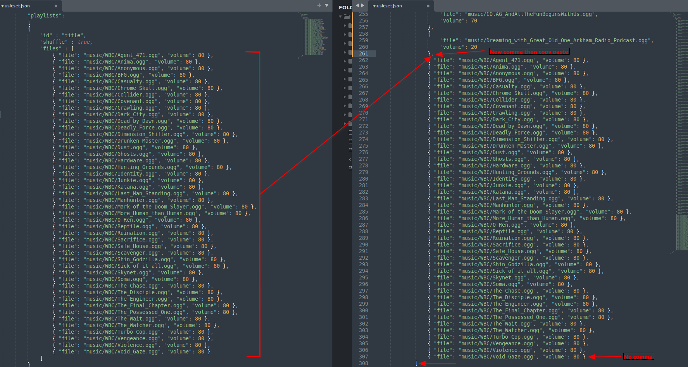

# What's this?
- Some royalty free musics that you can add directly to your favorite BN soundpack
- musicset.json contains all the musics path that BN will play randomly during gameplay. Knowing that:
## Method 1 - Replace everything
- Go inside `your_soundpack_path/music/`, delete everything, copy paste everything here (musicset.json, WBC etc.), you're done
## Method 2 - Add the musics while keeping the others from your soundpack
- Drag & Drop the musics folder(s) (WBC) in `your_soundpack_path/music/`
- open the musicset.json from your soundpack and the one here with a text editor
- in musicset.json, add a `,` after the last closed pointy bracket (the last music line), and copy paste the content inside the square brackets after `"files" :`

# Credits
- **all the musics in the WBC** *(White Bat Cyberpunk)* **folder are made by "Karl Casey @ White Bat Audio"**  and quoting him
	- "Can I use this in my video/stream/film/game/project/podcast etc.? -> Yes, my music is 100% copyright free so you can use it in ANY creative project, just credit me "music by Karl Casey @ White Bat Audio". What you CANNOT do is take my music and redistribute it as a product."